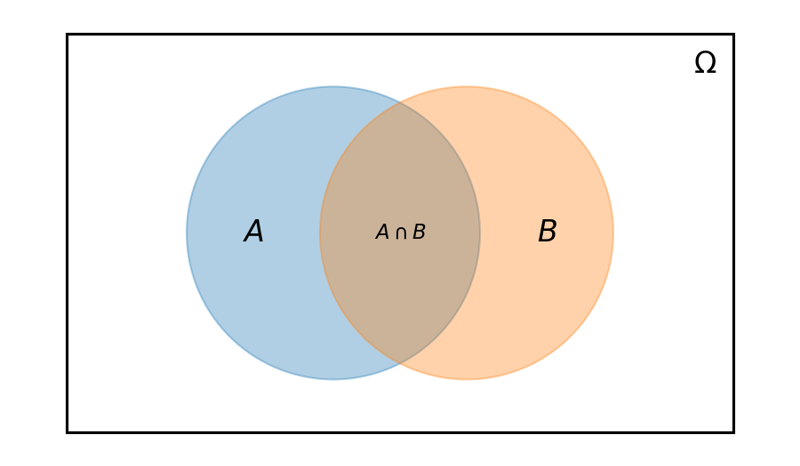
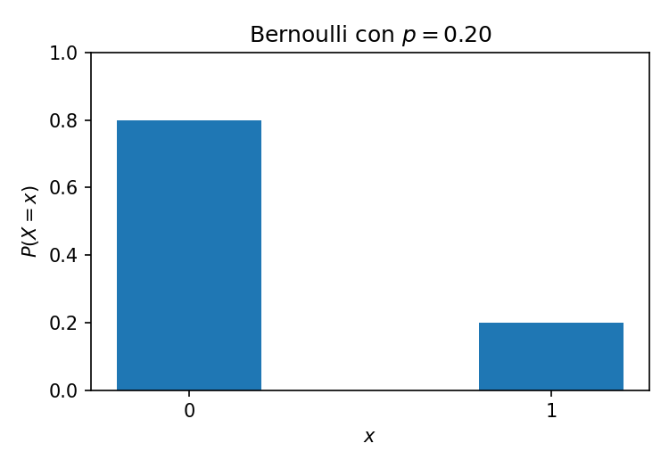
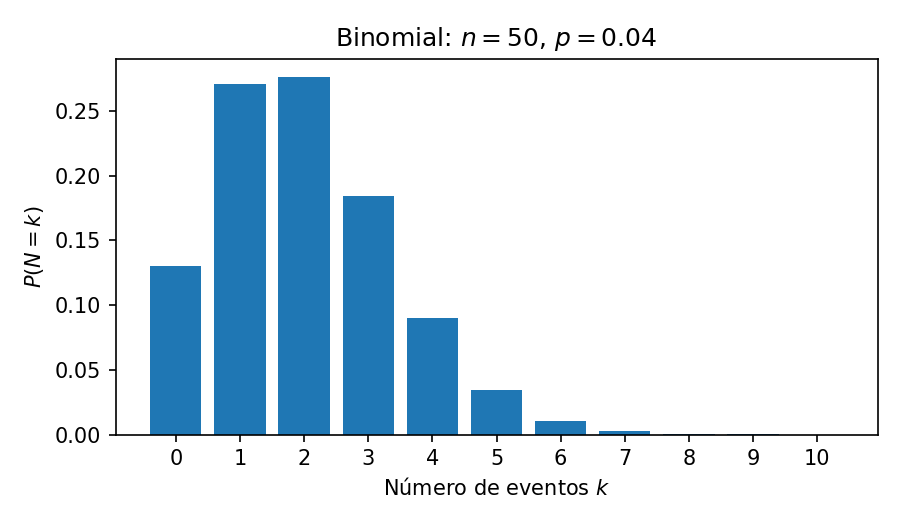
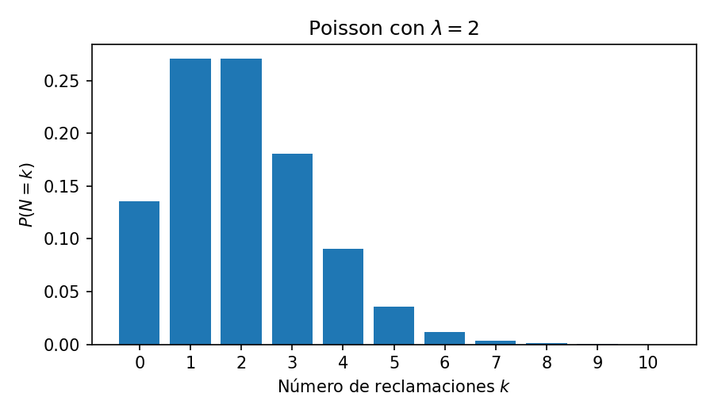
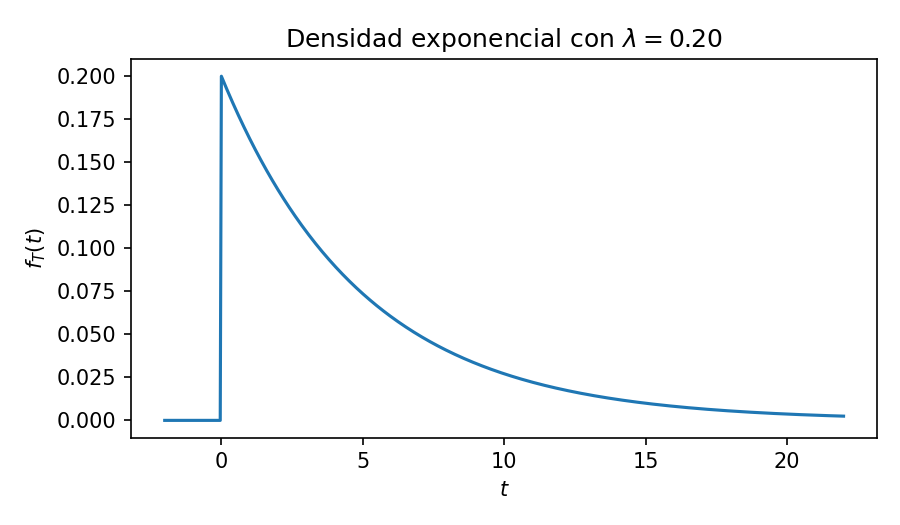
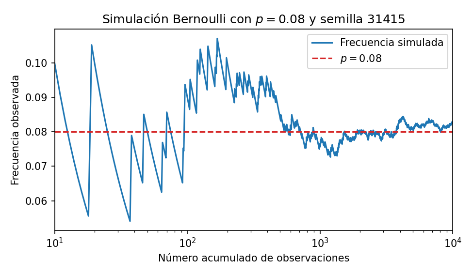
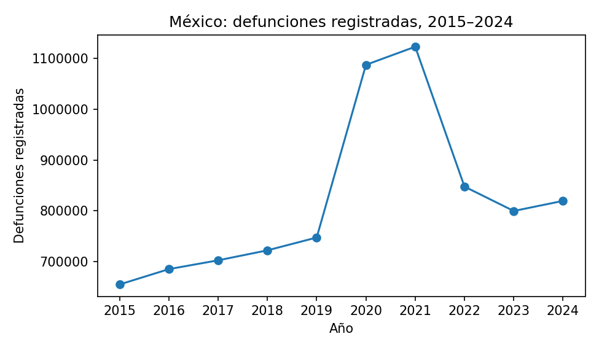
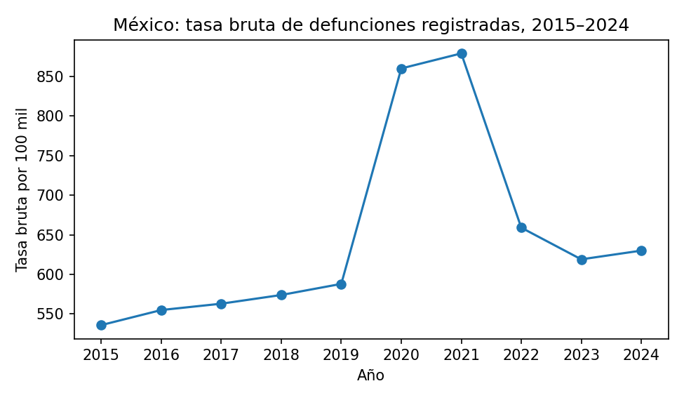

# Cálculo Actuarial II — Unidad I

## Preliminares probabilísticos y entorno computacional reproducible

*Notas de curso con Python, GitHub y datos públicos de México. México, 2026.*

> **Nota sobre esta versión.** Transcripción a Markdown del PDF original de la Unidad I (37 páginas). Las ecuaciones están en LaTeX (`$...$` en línea y `$$...$$` en bloque), que GitHub y VS Code muestran como fórmulas. Las figuras se regeneran con `docs/figuras/generar_figuras.py`. La numeración de secciones, definiciones, ejemplos y ejercicios es la del original.

Esta unidad construye el lenguaje probabilístico que se utilizará durante el curso y, simultáneamente, establece un flujo de trabajo reproducible: cada cálculo deberá poder ser entendido, ejecutado, verificado y reconstruido a partir de su código, sus datos y sus hipótesis.

---

## Índice

- [Propósito de la unidad](#propósito-de-la-unidad)
- [1. Antes de la probabilidad: qué problema resuelve un actuario](#1-antes-de-la-probabilidad-qué-problema-resuelve-un-actuario)
- [2. Entorno de trabajo: GitHub, Git, Python y Visual Studio Code](#2-entorno-de-trabajo-github-git-python-y-visual-studio-code)
- [3. Python mínimo para empezar a modelar riesgo](#3-python-mínimo-para-empezar-a-modelar-riesgo)
- [4. Lenguaje de probabilidad](#4-lenguaje-de-probabilidad)
- [5. Variables aleatorias](#5-variables-aleatorias)
- [6. Esperanza, varianza y dependencia](#6-esperanza-varianza-y-dependencia)
- [7. Cuantiles y transformaciones de pérdidas](#7-cuantiles-y-transformaciones-de-pérdidas)
- [8. Distribuciones discretas fundamentales](#8-distribuciones-discretas-fundamentales)
- [9. Distribuciones continuas fundamentales](#9-distribuciones-continuas-fundamentales)
- [10. De riesgos individuales a riesgo agregado](#10-de-riesgos-individuales-a-riesgo-agregado)
- [11. Ley de los grandes números y simulación](#11-ley-de-los-grandes-números-y-simulación)
- [12. Datos reales de México: cómo leerlos actuarialmente](#12-datos-reales-de-méxico-cómo-leerlos-actuarialmente)
- [13. Ejemplos completos de probabilidad actuarial](#13-ejemplos-completos-de-probabilidad-actuarial)
- [14. Errores conceptuales que deben evitarse desde la primera unidad](#14-errores-conceptuales-que-deben-evitarse-desde-la-primera-unidad)
- [15. Práctica guiada de la Unidad I](#15-práctica-guiada-de-la-unidad-i)
- [16. Ejercicios propuestos](#16-ejercicios-propuestos)
- [17. Lista de verificación al terminar la unidad](#17-lista-de-verificación-al-terminar-la-unidad)
- [Notación esencial](#notación-esencial)
- [Referencias](#referencias)

---

## Propósito de la unidad

El cálculo actuarial no consiste en sustituir símbolos dentro de una fórmula. El problema real es construir una representación matemática de una obligación incierta, elegir hipótesis que puedan defenderse, relacionarlas con información observable y producir un resultado que pueda auditarse. Por ello, desde la primera unidad trabajaremos en paralelo con tres lenguajes:

```
modelo matemático  ──►  implementación  ──►  datos
        ▲                                      │
        └──────────────  contraste  ◄──────────┘
```

El estudiante deberá aprender a pasar de una descripción verbal —"una póliza paga si ocurre un fallecimiento", "una cartera registra cierto número de siniestros", "el pago futuro es incierto"— a variables aleatorias, distribuciones, esperanzas y medidas de variabilidad. Después, deberá reproducir el cálculo con Python y documentarlo en Git.

> **Resultados de aprendizaje.** Al finalizar la unidad, el estudiante deberá ser capaz de:
>
> 1. construir un espacio probabilístico sencillo y distinguir entre resultado, evento y variable aleatoria;
> 2. utilizar probabilidad condicional, independencia, el teorema de Bayes y las leyes de probabilidad total;
> 3. calcular y explicar esperanza, varianza, covarianza, cuantiles y transformaciones de variables aleatorias;
> 4. reconocer las distribuciones Bernoulli, binomial, Poisson, geométrica, exponencial, gamma y normal, e identificar contextos actuariales razonables para cada una;
> 5. utilizar Python para calcular probabilidades, simular riesgos y visualizar distribuciones;
> 6. crear y mantener un repositorio de GitHub desde Visual Studio Code;
> 7. organizar datos, código, notebooks, pruebas y documentación de manera reproducible;
> 8. leer una estadística oficial mexicana sin confundir un conteo, una tasa bruta y una probabilidad individual de fallecimiento.

---

## 1. Antes de la probabilidad: qué problema resuelve un actuario

### 1.1 Incertidumbre, tiempo y dinero

Una obligación actuarial combina, por lo menos, tres ingredientes:

1. un evento incierto;
2. un monto que depende del evento;
3. un instante de pago, que puede ser incierto.

Un seguro de vida elemental puede prometer un beneficio $B$ al final del año de fallecimiento. Una póliza de automóvil puede pagar una severidad aleatoria $X$ si ocurre un siniestro. Una cartera puede producir un número aleatorio $N$ de reclamaciones. Una renta vitalicia paga mientras la persona permanezca con vida. En todos estos casos el resultado económico depende de variables aleatorias.

La forma conceptual más importante del curso será

$$
\text{valor actuarial} = \mathbb{E}[\text{valor presente aleatorio}].
$$

Más adelante el "valor presente aleatorio" tendrá estructuras mucho más ricas. En esta unidad aprenderemos a manipular la parte probabilística de esa expresión.

### 1.2 Una primera variable aleatoria actuarial

Sea $I$ el indicador de que ocurre un siniestro durante el año:

$$
I =
\begin{cases}
1, & \text{si ocurre el siniestro},\\
0, & \text{si no ocurre}.
\end{cases}
$$

Si la póliza paga una cantidad fija $B$, el costo aleatorio es

$$
X = BI.
$$

Si $\mathbb{P}(I = 1) = q$, entonces

$$
\mathbb{E}[X] = Bq.
$$

Esta igualdad sencilla es la semilla de modelos mucho más importantes: el valor esperado de una obligación depende del monto que se paga y de la probabilidad de que se active el pago.

> **Ejemplo 1.1 (Beneficio anual).** Una cobertura paga $B = \$500\,000$ al final del año si ocurre cierto evento cubierto. Para un ejemplo puramente didáctico, supongamos que la probabilidad anual es $q = 0.004$ y que no hay descuento financiero. Entonces
>
> $$\mathbb{E}[X] = 500\,000(0.004) = \$2\,000.$$
>
> El número $\$2\,000$ no es el pago que recibirá cada asegurado. Es el costo esperado por póliza bajo el modelo y las hipótesis dadas.

> **Observación 1.1.** El valor esperado no es por sí solo una prima comercial. En la realidad hay gastos, margen de riesgo, capital, comisiones, impuestos, regulación, selección, rescates, reaseguro, incertidumbre paramétrica y otras fuentes de costo. En esta unidad aislamos la estructura probabilística.

---

## 2. Entorno de trabajo: GitHub, Git, Python y Visual Studio Code

### 2.1 Por qué el entorno computacional forma parte del cálculo actuarial

En una hoja de cálculo es posible obtener un resultado correcto y, aun así, no saber exactamente qué se hizo tres semanas después. En un proyecto profesional es indispensable conservar la trazabilidad:

$$
\text{fuente de datos} \longrightarrow \text{transformación} \longrightarrow \text{modelo} \longrightarrow \text{resultado} \longrightarrow \text{reporte}.
$$

Git registrará la historia del proyecto; GitHub almacenará el repositorio remoto y facilitará colaboración y automatización; Python ejecutará los cálculos; Visual Studio Code será el espacio de trabajo. La extensión oficial de Python de VS Code no incluye el intérprete: Python debe instalarse por separado [7]. GitHub, por su parte, requiere una cuenta personal con correo verificado para realizar tareas básicas como crear repositorios [4].

### 2.2 Qué debe instalar cada estudiante

La instalación mínima será:

1. **GitHub:** una cuenta personal en <https://github.com/>.
2. **Git:** desde <https://git-scm.com/>. En Windows puede utilizarse la distribución oficial Git for Windows [9].
3. **Python 3:** desde <https://www.python.org/>.
4. **Visual Studio Code:** desde <https://code.visualstudio.com/>.
5. En VS Code, las extensiones **Python** y **Jupyter** de Microsoft.

No se requiere Anaconda ni GitHub Desktop para el flujo de este curso. Pueden utilizarse en otros contextos, pero aquí interesa que el estudiante vea con claridad la relación entre repositorio, intérprete, entorno virtual y dependencias.

### 2.3 Verificación de la instalación

Después de instalar, abrir una terminal integrada en VS Code y ejecutar:

```bash
git --version
python --version
code --version
```

En algunos equipos Windows el comando del intérprete puede ser `py` en lugar de `python`. En ese caso:

```bash
py --version
```

El curso debe usar una sola convención por equipo. Si `python` funciona correctamente, usaremos esa forma en las notas.

### 2.4 Configuración inicial de Git

Git necesita identificar al autor de cada cambio. Una sola vez en la computadora:

```bash
git config --global user.name "Nombre Apellido"
git config --global user.email "correo@ejemplo.com"
git config --global init.defaultBranch main
```

Conviene que el correo sea el mismo que se ha vinculado a GitHub o, si se desea privacidad, utilizar la dirección *noreply* que GitHub proporciona.

### 2.5 Seguridad de la cuenta

La cuenta de GitHub se convierte en parte de la identidad profesional del estudiante. Se recomienda activar autenticación de dos factores. GitHub la recomienda explícitamente como una capa adicional de seguridad [4].

Nunca deben subirse al repositorio:

- contraseñas;
- tokens de API;
- llaves privadas;
- archivos con datos personales o confidenciales;
- bases de datos cuya licencia impida redistribución.

Cuando en unidades posteriores utilicemos una API, los secretos se guardarán en variables de entorno y el archivo correspondiente se excluirá mediante `.gitignore`.

### 2.6 Creación del repositorio del curso

GitHub permite crear repositorios desde la interfaz web [5]. El repositorio individual se llamará, por ejemplo,

```
calculo-actuarial-ii-apellido-nombre
```

La visibilidad puede ser privada durante el semestre y hacerse pública al terminar, según la política del curso. Si es privada, se agrega al docente como colaborador.

Al crear el repositorio:

1. incluir un archivo `README.md`;
2. agregar una plantilla `.gitignore` para Python;
3. no agregar todavía archivos grandes de datos;
4. elegir la licencia solamente cuando se tenga claro qué materiales pueden redistribuirse.

### 2.7 Clonar el repositorio

Clonar significa construir una copia local completa del repositorio remoto [6]. Desde GitHub, copiar la URL HTTPS del repositorio y ejecutar:

```bash
git clone https://github.com/USUARIO/calculo-actuarial-ii-apellido-nombre.git
cd calculo-actuarial-ii-apellido-nombre
code .
```

El punto de `code .` significa "abrir la carpeta actual en VS Code".

### 2.8 Entorno virtual

Un entorno virtual aísla las bibliotecas del proyecto. Python recomienda una carpeta como `.venv` [8]. Desde la raíz del repositorio:

```bash
python -m venv .venv
```

En Windows, usando Command Prompt:

```bat
.venv\Scripts\activate.bat
```

En macOS o Linux:

```bash
source .venv/bin/activate
```

En PowerShell puede utilizarse `.venv\Scripts\Activate.ps1`. Si la política local impide ejecutar scripts, no es necesario modificar permanentemente la seguridad del sistema: puede elegirse Command Prompt como terminal integrada o crear el entorno desde la paleta de comandos de VS Code con **Python: Create Environment**.

Después se instalan las dependencias iniciales:

```bash
python -m pip install --upgrade pip
python -m pip install numpy pandas scipy matplotlib openpyxl requests jupyter ipykernel pytest
python -m pip freeze > requirements.txt
```

### 2.9 Seleccionar el intérprete correcto en VS Code

Abrir la paleta con `Ctrl+Shift+P`, buscar **Python: Select Interpreter** y elegir el intérprete que se encuentre dentro de `.venv`. Esta distinción es importante: VS Code es el editor, la extensión ofrece soporte al lenguaje y el intérprete ejecuta realmente el código [7].

### 2.10 Estructura obligatoria del repositorio

```
calculo-actuarial-ii-apellido-nombre/
|
|-- README.md
|-- requirements.txt
|-- .gitignore
|
|-- data/
|   |-- README.md
|   |-- raw/
|   `-- processed/
|
|-- notebooks/
|   `-- 01_probabilidad_actuarial.ipynb
|
|-- src/
|   |-- __init__.py
|   `-- probability.py
|
|-- tests/
|   `-- test_probability.py
|
|-- figures/
|-- reports/
`-- .github/
    `-- workflows/
        `-- tests.yml
```

La separación tiene una razón:

- `data/raw`: datos tal como fueron descargados;
- `data/processed`: datos limpios producidos por el código;
- `notebooks`: exploración, explicación y presentación;
- `src`: funciones reutilizables;
- `tests`: pruebas automáticas;
- `figures`: gráficas exportadas;
- `reports`: resultados finales.

> **Regla de oro de datos.** El archivo crudo nunca se edita manualmente. Si hay que corregir, recodificar o filtrar, se escribe código que produzca un archivo procesado. De ese modo la transformación puede repetirse.

### 2.11 Un `.gitignore` mínimo

```gitignore
.venv/
__pycache__/
*.pyc
.ipynb_checkpoints/
.env
.DS_Store

# Datos grandes descargables nuevamente
data/raw/*.csv
data/raw/*.CSV
data/raw/*.xlsx
```

No es obligatorio ignorar todos los datos. Un archivo pequeño y público puede conservarse si su licencia lo permite. Los microdatos grandes, en cambio, deben descargarse mediante un script o conservarse fuera del repositorio, con una referencia precisa en `data/README.md`.

### 2.12 El ciclo diario de Git

Los cinco comandos que se utilizarán constantemente son:

```bash
git status
git add .
git commit -m "feat: add binomial probability example"
git pull
git push
```

Su interpretación es:

1. `status`: ¿qué cambió?;
2. `add`: ¿qué cambios formarán parte de la fotografía?;
3. `commit`: guardar una fotografía local con mensaje;
4. `pull`: traer cambios del remoto;
5. `push`: enviar commits locales a GitHub.

Un commit debe representar una idea coherente. Son preferibles mensajes como

- `setup: create course repository structure`;
- `notes: add conditional probability derivation`;
- `feat: simulate Poisson claim counts`;
- `data: document INEGI EDR source`;
- `test: validate Bernoulli expectation function`;

a mensajes como `cambios`, `final`, `ya quedo` o `ahora si final`.

### 2.13 README como ficha técnica del proyecto

El archivo `README.md` debe responder, al menos:

1. ¿qué problema se estudia?;
2. ¿de dónde provienen los datos?;
3. ¿qué versión de Python se utiliza?;
4. ¿cómo se instala el entorno?;
5. ¿cómo se ejecuta el análisis?;
6. ¿qué archivos contienen los resultados?;
7. ¿cuáles son las principales hipótesis actuariales?

Una plantilla inicial puede ser:

```markdown
# Calculo Actuarial II

## Objetivo
Repositorio del curso de Calculo Actuarial II.

## Entorno
python -m venv .venv
python -m pip install -r requirements.txt

## Estructura
- data/: fuentes y datos procesados
- notebooks/: analisis explicados
- src/: funciones reutilizables
- tests/: validaciones automaticas

## Fuentes
Registrar aqui institucion, producto, anio, URL y fecha de descarga.
```

### 2.14 Primera automatización con pruebas

Desde la primera unidad se incorporará una prueba muy sencilla. En `src/probability.py`:

```python
def bernoulli_expected_cost(probability, benefit):
    if not 0 <= probability <= 1:
        raise ValueError("probability must be between 0 and 1")
    if benefit < 0:
        raise ValueError("benefit must be nonnegative")
    return probability * benefit
```

En `tests/test_probability.py`:

```python
from src.probability import bernoulli_expected_cost


def test_expected_cost():
    assert bernoulli_expected_cost(0.004, 500_000) == 2_000


def test_zero_probability():
    assert bernoulli_expected_cost(0.0, 500_000) == 0.0
```

Ejecutar:

```bash
pytest -q
```

El objetivo no es convertir la primera clase en ingeniería de software. Es introducir una idea crucial: una fórmula actuarial puede acompañarse de verificaciones automáticas.

### 2.15 GitHub Actions: comprobar el proyecto en cada cambio

En `.github/workflows/tests.yml` puede colocarse:

```yaml
name: tests

on:
  push:
  pull_request:

jobs:
  probability-tests:
    runs-on: ubuntu-latest
    steps:
      - uses: actions/checkout@v4
      - uses: actions/setup-python@v5
        with:
          python-version: '3.12'
      - run: python -m pip install -r requirements.txt
      - run: pytest -q
```

Así, GitHub ejecuta las pruebas cuando se suben cambios. Más adelante el mismo mecanismo podrá validar datos, recalcular resultados o generar reportes. La automatización no sustituye la comprensión: evita repetir manualmente tareas que ya sabemos definir con precisión.

---

## 3. Python mínimo para empezar a modelar riesgo

### 3.1 Variables y tipos numéricos

Python distingue enteros, números de punto flotante, booleanos y cadenas de texto. Para un cálculo actuarial elemental:

```python
benefit = 500_000
q = 0.004
expected_cost = benefit * q

print(expected_cost)
```

El guion bajo en `500_000` mejora legibilidad y no cambia el valor numérico.

### 3.2 Funciones

Una fórmula que se repetirá debe convertirse en función:

```python
def expected_fixed_benefit(q, benefit):
    return q * benefit

value = expected_fixed_benefit(q=0.004, benefit=500_000)
```

Una función permite probar el cálculo, reutilizarlo y separar el modelo de la presentación.

### 3.3 NumPy: cálculo vectorizado

Una cartera contiene muchas pólizas o edades. NumPy permite operar con vectores completos:

```python
import numpy as np

q = np.array([0.0018, 0.0021, 0.0026, 0.0032])
benefit = 500_000
expected_cost = q * benefit

print(expected_cost)
```

En vez de escribir cuatro multiplicaciones, se expresa la operación matemática sobre un vector.

### 3.4 Pandas: tablas de datos

```python
import pandas as pd

portfolio = pd.DataFrame({
    "age": [35, 40, 45, 50],
    "q": [0.0018, 0.0021, 0.0026, 0.0032],
    "benefit": [500_000, 500_000, 750_000, 1_000_000],
})

portfolio["expected_cost"] = portfolio["q"] * portfolio["benefit"]
print(portfolio)
```

Una tabla actuarial no es solamente una colección de celdas. Cada columna debe tener una interpretación clara, unidad, procedencia y regla de transformación.

### 3.5 Matplotlib: una gráfica como diagnóstico

```python
import matplotlib.pyplot as plt

plt.plot(portfolio["age"], portfolio["q"], marker="o")
plt.xlabel("Edad")
plt.ylabel("Probabilidad anual")
plt.title("Probabilidad por edad: ejemplo didactico")
plt.show()
```

Una gráfica es parte del control del modelo. Antes de confiar en una tabla de mortalidad, frecuencia o severidad conviene observar su forma, saltos, valores extremos y posibles inconsistencias.

### 3.6 SciPy: distribuciones de probabilidad

```python
from scipy import stats

n = 50
q = 0.04
prob_two = stats.binom.pmf(2, n=n, p=q)
prob_at_most_two = stats.binom.cdf(2, n=n, p=q)

print(prob_two)
print(prob_at_most_two)
```

La función `pmf` evalúa una función de masa de probabilidad; `cdf` evalúa una función de distribución acumulada.

### 3.7 Semillas y reproducibilidad

Una simulación pseudoaleatoria debe ser reproducible cuando se utiliza para una práctica, una prueba o un reporte:

```python
import numpy as np

rng = np.random.default_rng(31415)
sample = rng.binomial(n=1, p=0.08, size=10_000)
print(sample.mean())
```

La semilla no "hace más aleatoria" la simulación. Permite reconstruir exactamente la misma secuencia pseudoaleatoria.

---

## 4. Lenguaje de probabilidad

### 4.1 Experimento, resultados y eventos

> **Definición 4.1 (Espacio muestral).** El espacio muestral $\Omega$ es el conjunto de todos los resultados elementales que el modelo considera posibles.

Para un indicador anual de siniestro,

$$
\Omega = \lbrace 0, 1 \rbrace,
$$

donde 0 significa "no ocurre" y 1 significa "ocurre".

Para el número de reclamaciones de una cartera,

$$
\Omega = \lbrace 0, 1, 2, \ldots \rbrace.
$$

Para el tiempo hasta un evento,

$$
\Omega = [0, \infty).
$$

Un evento es una colección de resultados. Si $N$ es el número de reclamaciones,

$$
A = \lbrace N \ge 3 \rbrace
$$

es el evento "se observan por lo menos tres reclamaciones".

### 4.2 Por qué aparece una σ-álgebra

En cursos elementales se dice simplemente que todo subconjunto de $\Omega$ es un evento. En espacios continuos esa idea puede producir conjuntos a los que no puede asignarse una probabilidad de manera coherente. Por ello se selecciona una familia $\mathcal{F}$ de eventos medibles.

> **Definición 4.2 (σ-álgebra).** Una colección $\mathcal{F}$ de subconjuntos de $\Omega$ es una σ-álgebra si:
>
> 1. $\Omega \in \mathcal{F}$;
> 2. si $A \in \mathcal{F}$, entonces $A^c \in \mathcal{F}$;
> 3. si $A_1, A_2, \ldots \in \mathcal{F}$, entonces $\bigcup_{n=1}^{\infty} A_n \in \mathcal{F}$.

La notación no es un lujo. Más adelante, cuando condicionemos respecto de la información disponible en un instante, la noción de conjunto de información será esencial.

### 4.3 Espacio de probabilidad

> **Definición 4.3 (Espacio de probabilidad).** Un espacio de probabilidad es una terna
>
> $$(\Omega, \mathcal{F}, \mathbb{P})$$
>
> donde $\mathbb{P} : \mathcal{F} \to [0, 1]$ satisface:
>
> 1. $\mathbb{P}(\Omega) = 1$;
> 2. $\mathbb{P}(A) \ge 0$ para todo $A \in \mathcal{F}$;
> 3. si $A_1, A_2, \ldots$ son disjuntos dos a dos, entonces
>
> $$\mathbb{P}\left( \bigcup_{n=1}^{\infty} A_n \right) = \sum_{n=1}^{\infty} \mathbb{P}(A_n).$$

### 4.4 Operaciones con eventos



*Figura 1: Dos eventos. La intersección representa la ocurrencia simultánea.*

Las operaciones elementales son:

| Operación | Significado |
|---|---|
| $A \cup B$ | ocurre $A$ o $B$ (o ambos) |
| $A \cap B$ | ocurren $A$ y $B$ |
| $A^c$ | no ocurre $A$ |
| $A \setminus B$ | ocurre $A$ pero no $B$ |

De los axiomas se obtiene

$$
\mathbb{P}(A^c) = 1 - \mathbb{P}(A)
$$

y

$$
\mathbb{P}(A \cup B) = \mathbb{P}(A) + \mathbb{P}(B) - \mathbb{P}(A \cap B).
$$

> **Ejemplo 4.1 (Dos coberturas).** Sea $A$ el evento de que una póliza tenga una reclamación por cobertura A durante el año y $B$ el evento de reclamación por cobertura B. Si
>
> $$\mathbb{P}(A) = 0.08, \quad \mathbb{P}(B) = 0.05, \quad \mathbb{P}(A \cap B) = 0.015,$$
>
> entonces
>
> $$\mathbb{P}(A \cup B) = 0.08 + 0.05 - 0.015 = 0.115.$$
>
> El 11.5 % corresponde a tener por lo menos una de las dos reclamaciones bajo este ejemplo.

### 4.5 Probabilidad condicional

> **Definición 4.4 (Probabilidad condicional).** Si $\mathbb{P}(B) > 0$, se define
>
> $$\mathbb{P}(A \mid B) = \frac{\mathbb{P}(A \cap B)}{\mathbb{P}(B)}.$$

Condicionar significa cambiar el universo de referencia. Ya no preguntamos "¿con qué probabilidad ocurre $A$?", sino "¿con qué probabilidad ocurre $A$ sabiendo que $B$ ha ocurrido?".

En cálculo actuarial la condicionalidad es omnipresente. Una probabilidad como

$$
{}_t p_x = \mathbb{P}(T_x > t)
$$

se interpreta para una persona que ya ha alcanzado la edad $x$. La selección de información previa cambia la población de referencia.

> **Ejemplo 4.2 (Segmentación de cartera).** Una cartera didáctica tiene dos segmentos. El 60 % pertenece al segmento A y el 40 % al B. Las probabilidades anuales de reclamación son
>
> $$\mathbb{P}(C \mid A) = 0.02, \qquad \mathbb{P}(C \mid B) = 0.06.$$
>
> ¿Cuál es la probabilidad de que una póliza elegida al azar tenga una reclamación?
>
> Por probabilidad total,
>
> $$\mathbb{P}(C) = 0.02(0.60) + 0.06(0.40) = 0.036.$$
>
> Por tanto, en este ejemplo la frecuencia media es 3.6 %.

### 4.6 Ley de probabilidad total

Si $B_1, \ldots, B_k$ forman una partición de $\Omega$ y $\mathbb{P}(B_j) > 0$, entonces

$$
\mathbb{P}(A) = \sum_{j=1}^{k} \mathbb{P}(A \mid B_j)\,\mathbb{P}(B_j).
$$

La fórmula explica por qué una frecuencia agregada puede cambiar aunque las frecuencias condicionales permanezcan estables: basta con que cambie la composición de la cartera. Este fenómeno es central al comparar periodos, regiones o grupos de asegurados.

### 4.7 Teorema de Bayes

> **Teorema 4.1 (Bayes).** Si $B_1, \ldots, B_k$ forman una partición de $\Omega$, entonces
>
> $$\mathbb{P}(B_j \mid A) = \frac{\mathbb{P}(A \mid B_j)\,\mathbb{P}(B_j)}{\sum_{r=1}^{k} \mathbb{P}(A \mid B_r)\,\mathbb{P}(B_r)}.$$

Retomando el ejemplo anterior,

$$
\mathbb{P}(B \mid C) = \frac{0.06(0.40)}{0.036} = \frac{2}{3}.
$$

Aunque solamente 40 % de la cartera pertenece al segmento B, dos terceras partes de las reclamaciones provienen de él bajo las hipótesis del ejemplo.

> **Interpretación actuarial.** Bayes permite actualizar probabilidades después de observar información. Esta idea aparece en credibilidad, clasificación de riesgo, detección de fraude y modelos predictivos. El cálculo no debe confundirse con causalidad: que una característica sea informativa no significa que cause el siniestro.

### 4.8 Independencia

> **Definición 4.5 (Independencia).** Dos eventos $A$ y $B$ son independientes si
>
> $$\mathbb{P}(A \cap B) = \mathbb{P}(A)\,\mathbb{P}(B).$$
>
> Equivalentemente, si $\mathbb{P}(B) > 0$,
>
> $$\mathbb{P}(A \mid B) = \mathbb{P}(A).$$

Independencia significa que conocer $B$ no modifica la probabilidad de $A$. No significa que los eventos sean mutuamente excluyentes. De hecho, si $A$ y $B$ son disjuntos y ambos tienen probabilidad positiva, no pueden ser independientes.

En un portafolio, suponer independencia entre pólizas puede ser razonable para ciertos riesgos idiosincráticos, pero falla frente a eventos comunes: epidemias, catástrofes, inflación de costos médicos, cambios regulatorios o choques financieros. El supuesto debe declararse, no esconderse.

---

## 5. Variables aleatorias

### 5.1 Definición

> **Definición 5.1 (Variable aleatoria).** Una variable aleatoria es una función medible
>
> $$X : \Omega \longrightarrow \mathbb{R}.$$

La palabra "aleatoria" no significa que la función cambie. La regla $X(\omega)$ es fija; lo incierto es qué resultado $\omega$ ocurrirá.

Ejemplos actuariales:

- $I$: indicador de siniestro;
- $N$: número de reclamaciones;
- $X$: monto de una reclamación;
- $T$: tiempo hasta fallecimiento o hasta un evento;
- $S$: pérdida agregada de una cartera.

### 5.2 Variables discretas

Una variable discreta toma valores en un conjunto finito o numerable. Su función de masa es

$$
p_X(x) = \mathbb{P}(X = x).
$$

Debe satisfacer

$$
p_X(x) \ge 0, \qquad \sum_x p_X(x) = 1.
$$

### 5.3 Variables continuas

Una variable continua puede describirse mediante una densidad $f_X$ tal que

$$
f_X(x) \ge 0, \qquad \int_{-\infty}^{\infty} f_X(x)\,dx = 1,
$$

y

$$
\mathbb{P}(a < X \le b) = \int_a^b f_X(x)\,dx.
$$

En una variable continua,

$$
\mathbb{P}(X = x) = 0
$$

para cada valor individual. La densidad no es una probabilidad puntual.

### 5.4 Función de distribución

> **Definición 5.2 (CDF).** La función de distribución acumulada es
>
> $$F_X(x) = \mathbb{P}(X \le x).$$

Toda CDF es no decreciente, continua por la derecha y satisface

$$
\lim_{x \to -\infty} F_X(x) = 0, \qquad \lim_{x \to \infty} F_X(x) = 1.
$$

Si $X$ es continua y $F_X$ es derivable,

$$
f_X(x) = F_X'(x).
$$

### 5.5 Indicadores

Un indicador es una de las herramientas más útiles en probabilidad:

$$
\mathbf{1}_A =
\begin{cases}
1, & A \text{ ocurre},\\
0, & A \text{ no ocurre}.
\end{cases}
$$

Entonces

$$
\mathbb{E}[\mathbf{1}_A] = \mathbb{P}(A).
$$

Si $N$ es el número de pólizas con siniestro en una cartera de $n$ contratos,

$$
N = \sum_{j=1}^{n} I_j,
$$

donde $I_j$ indica si la póliza $j$ tuvo siniestro. Por linealidad de la esperanza,

$$
\mathbb{E}[N] = \sum_{j=1}^{n} \mathbb{E}[I_j] = \sum_{j=1}^{n} \mathbb{P}(I_j = 1).
$$

Este resultado no requiere independencia.

---

## 6. Esperanza, varianza y dependencia

### 6.1 Esperanza

Para una variable discreta,

$$
\mathbb{E}[X] = \sum_x x\,p_X(x),
$$

y para una continua,

$$
\mathbb{E}[X] = \int_{-\infty}^{\infty} x\,f_X(x)\,dx,
$$

si la integral correspondiente existe.

Más generalmente, para una función $g$,

$$
\mathbb{E}[g(X)] = \sum_x g(x)\,p_X(x)
$$

en el caso discreto, o

$$
\mathbb{E}[g(X)] = \int_{-\infty}^{\infty} g(x)\,f_X(x)\,dx
$$

en el continuo. Este principio suele llamarse LOTUS: *Law of the Unconscious Statistician*.

### 6.2 Linealidad

Para constantes $a, b$,

$$
\mathbb{E}[aX + b] = a\,\mathbb{E}[X] + b.
$$

Y para cualquier número finito de variables integrables,

$$
\mathbb{E}\left[ \sum_{j=1}^{n} X_j \right] = \sum_{j=1}^{n} \mathbb{E}[X_j].
$$

La independencia no es necesaria.

> **Ejemplo 6.1 (Costo esperado de una cartera heterogénea).** Tres pólizas tienen beneficios $B_1, B_2, B_3$ y probabilidades $q_1, q_2, q_3$. Si
>
> $$S = B_1 I_1 + B_2 I_2 + B_3 I_3,$$
>
> entonces
>
> $$\mathbb{E}[S] = B_1 q_1 + B_2 q_2 + B_3 q_3,$$
>
> incluso si los indicadores no son independientes.

### 6.3 Varianza

> **Definición 6.1 (Varianza).**
>
> $$\operatorname{Var}(X) = \mathbb{E}\left[(X - \mathbb{E}[X])^2\right].$$

La identidad computacional es

$$
\operatorname{Var}(X) = \mathbb{E}[X^2] - \mathbb{E}[X]^2.
$$

La desviación estándar es

$$
\sigma_X = \sqrt{\operatorname{Var}(X)}.
$$

Para $a, b \in \mathbb{R}$,

$$
\operatorname{Var}(aX + b) = a^2 \operatorname{Var}(X).
$$

### 6.4 Covarianza

$$
\operatorname{Cov}(X, Y) = \mathbb{E}\left[(X - \mathbb{E}[X])(Y - \mathbb{E}[Y])\right] = \mathbb{E}[XY] - \mathbb{E}[X]\,\mathbb{E}[Y].
$$

Por ello,

$$
\operatorname{Var}(X + Y) = \operatorname{Var}(X) + \operatorname{Var}(Y) + 2\operatorname{Cov}(X, Y).
$$

Para $n$ variables,

$$
\operatorname{Var}\left( \sum_{j=1}^{n} X_j \right) = \sum_{j=1}^{n} \operatorname{Var}(X_j) + 2 \sum_{i<j} \operatorname{Cov}(X_i, X_j).
$$

Este término de covarianza explica por qué el riesgo agregado puede ser mucho mayor cuando hay dependencia común. En seguros catastróficos o mortalidad durante una epidemia, ignorar dependencia puede subestimar la dispersión de la pérdida total.

### 6.5 Esperanza condicional y ley iterada

Si $Y$ representa información observable, $\mathbb{E}[X \mid Y]$ es una variable aleatoria que resume el valor esperado de $X$ dado $Y$. Una identidad central es

$$
\mathbb{E}[X] = \mathbb{E}\big[\mathbb{E}[X \mid Y]\big].
$$

La varianza se descompone como

$$
\operatorname{Var}(X) = \mathbb{E}[\operatorname{Var}(X \mid Y)] + \operatorname{Var}(\mathbb{E}[X \mid Y]).
$$

Interpretación:

- $\mathbb{E}[\operatorname{Var}(X \mid Y)]$ mide variabilidad **dentro** de los grupos definidos por $Y$;
- $\operatorname{Var}(\mathbb{E}[X \mid Y])$ mide variabilidad **entre** los promedios de esos grupos.

Esta identidad aparecerá naturalmente en modelos de mezcla y credibilidad.

---

## 7. Cuantiles y transformaciones de pérdidas

### 7.1 Cuantil

Para $0 < \alpha < 1$, un cuantil de nivel $\alpha$ puede definirse mediante

$$
q_\alpha = \inf\lbrace x : F_X(x) \ge \alpha \rbrace.
$$

Por ejemplo, el percentil 95 deja aproximadamente 95 % de la distribución a su izquierda. En administración de riesgos, los cuantiles son importantes porque la media no describe la cola de una distribución.

### 7.2 Deducible

Si $X$ es la pérdida y existe un deducible ordinario $d$, el pago del asegurador es

$$
Y = (X - d)_+ = \max\lbrace X - d,\, 0 \rbrace.
$$

Su esperanza es

$$
\mathbb{E}[(X - d)_+].
$$

Para una variable continua no negativa puede escribirse como

$$
\mathbb{E}[(X - d)_+] = \int_d^{\infty} \mathbb{P}(X > x)\,dx.
$$

Esta identidad conecta la función de supervivencia de una severidad con el costo esperado del contrato.

### 7.3 Límite

Si el asegurador paga como máximo $u$,

$$
Y = \min\lbrace X, u \rbrace.
$$

Si se combinan deducible y límite, la función de pago debe escribirse explícitamente antes de programarla. El código correcto comienza con un contrato matemáticamente bien definido.

---

## 8. Distribuciones discretas fundamentales

### 8.1 Bernoulli

> **Definición 8.1.** $X \sim \text{Bernoulli}(p)$ si
>
> $$\mathbb{P}(X = 1) = p, \qquad \mathbb{P}(X = 0) = 1 - p.$$

Entonces

$$
\mathbb{E}[X] = p, \qquad \operatorname{Var}(X) = p(1 - p).
$$



*Figura 2: Función de masa de una variable Bernoulli.*

**Usos actuariales.**

- fallece/no fallece durante un periodo;
- hay/no hay reclamación;
- póliza activa/cancelada;
- ocurre/no ocurre un decremento específico.

En Python:

```python
from scipy import stats

p = 0.20
print(stats.bernoulli.mean(p))
print(stats.bernoulli.var(p))
```

### 8.2 Binomial

Si $X_1, \ldots, X_n$ son Bernoulli independientes con la misma probabilidad $p$, entonces

$$
N = X_1 + \cdots + X_n
$$

tiene distribución binomial:

$$
N \sim \text{Binomial}(n, p).
$$

Su función de masa es

$$
\mathbb{P}(N = k) = \binom{n}{k} p^k (1 - p)^{n-k}, \qquad k = 0, 1, \ldots, n.
$$

Además,

$$
\mathbb{E}[N] = np, \qquad \operatorname{Var}(N) = np(1 - p).
$$



*Figura 3: Número de eventos en 50 riesgos independientes con probabilidad 0.04.*

> **Ejemplo 8.1 (Número de fallecimientos en un portafolio hipotético).** Supongamos, únicamente para ilustrar la distribución, 50 vidas independientes con la misma probabilidad anual $q = 0.04$. Entonces
>
> $$N \sim \text{Binomial}(50, 0.04),$$
>
> por lo que
>
> $$\mathbb{E}[N] = 2, \qquad \operatorname{Var}(N) = 1.92.$$
>
> La probabilidad de exactamente dos eventos es aproximadamente 0.2762.

> **Observación 8.1.** En una cartera real las probabilidades suelen variar por edad, duración, suma asegurada, selección y otras características. Si los $p_j$ son distintos, la suma de Bernoulli ya no es binomial; aparece la distribución Poisson-binomial. La binomial es un punto de partida, no una descripción automática de toda cartera.

### 8.3 Poisson

> **Definición 8.2.** $N \sim \text{Poisson}(\lambda)$ si
>
> $$\mathbb{P}(N = k) = e^{-\lambda} \frac{\lambda^k}{k!}, \qquad k = 0, 1, 2, \ldots$$

Sus dos primeros momentos son

$$
\mathbb{E}[N] = \lambda, \qquad \operatorname{Var}(N) = \lambda.
$$



*Figura 4: Distribución Poisson para una frecuencia esperada de dos eventos.*

**Usos actuariales.** La Poisson es un modelo clásico para conteos de reclamaciones en un intervalo cuando los eventos son relativamente raros y la tasa se considera estable. También surge como límite de la binomial cuando $n$ es grande, $p$ es pequeño y $np \to \lambda$.

En Python:

```python
from scipy import stats

lam = 2
p_exactly_3 = stats.poisson.pmf(3, mu=lam)
p_more_than_3 = 1 - stats.poisson.cdf(3, mu=lam)
```

#### 8.3.1 Diagnóstico importante: equidispersión

La Poisson impone

$$
\operatorname{Var}(N) = \mathbb{E}[N].
$$

Si en datos reales la varianza es mucho mayor que la media, existe **sobredispersión** y puede ser preferible una binomial negativa, una mezcla Poisson o un modelo con heterogeneidad. Nunca se elige Poisson solamente porque la variable sea un conteo.

### 8.4 Geométrica

Una convención útil es contar el número de ensayos hasta el primer éxito:

$$
\mathbb{P}(N = k) = (1 - p)^{k-1} p, \qquad k = 1, 2, \ldots
$$

Entonces

$$
\mathbb{E}[N] = \frac{1}{p}, \qquad \operatorname{Var}(N) = \frac{1 - p}{p^2}.
$$

La distribución geométrica tiene la propiedad de falta de memoria:

$$
\mathbb{P}(N > m + n \mid N > m) = \mathbb{P}(N > n).
$$

En aplicaciones actuariales puede utilizarse como modelo elemental de espera discreta, pero la falta de memoria debe justificarse.

---

## 9. Distribuciones continuas fundamentales

### 9.1 Uniforme

Si $X \sim U(a, b)$,

$$
f_X(x) = \frac{1}{b - a}, \qquad a < x < b,
$$

y

$$
\mathbb{E}[X] = \frac{a + b}{2}, \qquad \operatorname{Var}(X) = \frac{(b - a)^2}{12}.
$$

En actuaría su uso directo como distribución de severidad es limitado, pero es fundamental para simulación: si $U \sim U(0, 1)$, muchas distribuciones pueden generarse mediante la transformación inversa

$$
X = F^{-1}(U).
$$

### 9.2 Exponencial

> **Definición 9.1.** $T \sim \text{Exp}(\lambda)$ si
>
> $$f_T(t) = \lambda e^{-\lambda t}, \qquad t \ge 0.$$

La función de supervivencia es

$$
\mathbb{P}(T > t) = e^{-\lambda t},
$$

y

$$
\mathbb{E}[T] = \frac{1}{\lambda}, \qquad \operatorname{Var}(T) = \frac{1}{\lambda^2}.
$$



*Figura 5: Densidad exponencial. La fuerza instantánea es constante.*

La exponencial también es sin memoria:

$$
\mathbb{P}(T > s + t \mid T > s) = \mathbb{P}(T > t).
$$

En términos de supervivencia, su fuerza de mortalidad o intensidad es constante:

$$
\mu(t) = \lambda.
$$

Este supuesto es demasiado restrictivo para mortalidad humana a lo largo de muchas edades, pero es un modelo elemental indispensable para comprender intensidades y tiempos de espera.

### 9.3 Gamma

Una parametrización frecuente es

$$
X \sim \text{Gamma}(\alpha, \theta),
$$

con densidad

$$
f_X(x) = \frac{x^{\alpha - 1} e^{-x/\theta}}{\Gamma(\alpha)\,\theta^\alpha}, \qquad x > 0.
$$

Entonces

$$
\mathbb{E}[X] = \alpha\theta, \qquad \operatorname{Var}(X) = \alpha\theta^2.
$$

La gamma es positiva y flexible; puede modelar severidades con sesgo a la derecha. Si $\alpha = 1$, se obtiene la exponencial.

### 9.4 Normal

Si $X \sim N(\mu, \sigma^2)$,

$$
f_X(x) = \frac{1}{\sigma\sqrt{2\pi}} \exp\left( -\frac{1}{2} \left( \frac{x - \mu}{\sigma} \right)^2 \right).
$$

La normal es simétrica y admite valores negativos. Por ello no siempre es una buena elección para costos individuales positivos, especialmente si la distribución real tiene cola derecha pesada. Sin embargo, aparece de forma natural en aproximaciones de sumas y en el Teorema Central del Límite.

> **Advertencia.** No se debe elegir una distribución por costumbre. Primero se estudia el soporte, la forma de la cola, la media-varianza, el mecanismo generador y la calidad del ajuste.

---

## 10. De riesgos individuales a riesgo agregado

### 10.1 Suma de pérdidas

Sea

$$
S = X_1 + \cdots + X_n
$$

la pérdida agregada de una cartera. Siempre que existan las esperanzas,

$$
\mathbb{E}[S] = \sum_{j=1}^{n} \mathbb{E}[X_j].
$$

Si además las variables son independientes,

$$
\operatorname{Var}(S) = \sum_{j=1}^{n} \operatorname{Var}(X_j).
$$

Si son idénticamente distribuidas con media $\mu$ y varianza $\sigma^2$,

$$
\mathbb{E}[S] = n\mu, \qquad \operatorname{Var}(S) = n\sigma^2.
$$

El coeficiente de variación de $S$ es

$$
\frac{\sqrt{n}\,\sigma}{n\mu} = \frac{1}{\sqrt{n}} \frac{\sigma}{\mu}.
$$

Esta disminución relativa ilustra la diversificación bajo independencia.

### 10.2 Modelo colectivo

En seguros generales resulta natural escribir

$$
S = \sum_{j=1}^{N} X_j,
$$

donde $N$ es el número de reclamaciones y $X_j$ sus severidades.

Si $N$ es independiente de severidades iid con

$$
\mathbb{E}[X_1] = \mu, \qquad \operatorname{Var}(X_1) = \sigma^2,
$$

entonces por esperanza condicional

$$
\mathbb{E}[S] = \mathbb{E}\big[\mathbb{E}[S \mid N]\big] = \mathbb{E}[N\mu] = \mu\,\mathbb{E}[N].
$$

Asimismo,

$$
\operatorname{Var}(S) = \mathbb{E}[N]\,\sigma^2 + \operatorname{Var}(N)\,\mu^2.
$$

Si $N \sim \text{Poisson}(\lambda)$,

$$
\mathbb{E}[S] = \lambda\mu, \qquad \operatorname{Var}(S) = \lambda(\sigma^2 + \mu^2).
$$

Esta fórmula es un primer puente entre frecuencia y severidad.

---

## 11. Ley de los grandes números y simulación

### 11.1 La idea

Si $X_1, X_2, \ldots$ son iid con media finita $\mu$, la ley de los grandes números afirma, en una de sus formas, que

$$
\bar{X}_n = \frac{1}{n} \sum_{j=1}^{n} X_j \longrightarrow \mu
$$

cuando $n$ crece.

En seguros, esta propiedad explica por qué una cartera grande puede ofrecer mayor estabilidad relativa, siempre que las hipótesis de independencia, homogeneidad suficiente y momentos finitos sean razonables.



*Figura 6: Simulación Bernoulli con $p = 0.08$ y semilla 31415 (eje horizontal logarítmico). La frecuencia empírica fluctúa; la convergencia no significa monotonicidad.*

Código correspondiente:

```python
import numpy as np

rng = np.random.default_rng(31415)
x = rng.binomial(n=1, p=0.08, size=10_000)

for n in [10, 20, 50, 100, 200, 500, 1000, 2000, 5000, 10000]:
    print(n, x[:n].mean())
```

> **Observación 11.1.** Una cartera grande no elimina riesgo sistemático. Si muchas pólizas responden al mismo choque, aumentar $n$ no produce la misma diversificación que bajo independencia.

---

## 12. Datos reales de México: cómo leerlos actuarialmente

### 12.1 INEGI y las Estadísticas de Defunciones Registradas

El INEGI publica las Estadísticas de Defunciones Registradas (EDR). Su objetivo es generar y difundir información sobre la mortalidad registrada en el país y sus características [2]. Para 2024, el archivo documentado por INEGI contiene 819 672 casos y 74 variables en el archivo de datos DEFUN24 [3]. El reporte definitivo indica que los datos fueron suministrados por 4 930 fuentes informantes y que la tasa bruta nacional fue de 630 defunciones registradas por cada 100 mil habitantes [1].

Los datos nacionales reportados para 2015–2024 son:

**Cuadro 1: Defunciones registradas y tasa bruta nacional, México.**

| Año | Defunciones registradas | Tasa por 100 mil |
|---:|---:|---:|
| 2015 | 655 688 | 536 |
| 2016 | 685 766 | 555 |
| 2017 | 703 047 | 563 |
| 2018 | 722 611 | 574 |
| 2019 | 747 784 | 588 |
| 2020 | 1 086 743 | 860 |
| 2021 | 1 122 249 | 879 |
| 2022 | 847 716 | 659 |
| 2023 | 799 869 | 619 |
| 2024 | 819 672 | 630 |

*Fuente: INEGI, EDR 2015–2024 [1].*



*Figura 7: Serie real de INEGI. El salto 2020–2021 obliga a pensar en dependencia y choques comunes.*



*Figura 8: Tasa bruta reportada por INEGI; no es una tabla de mortalidad ni un $q_x$.*

### 12.2 Conteo, tasa y probabilidad: tres objetos distintos

Este punto es fundamental.

**Conteo.** 819 672 es el número de defunciones registradas en el periodo de referencia. Es una frecuencia absoluta.

**Tasa bruta.** 630 por 100 mil habitantes equivale numéricamente a

$$
\frac{630}{100\,000} = 0.00630.
$$

Pero esta tasa agrega edades, sexos y estructuras poblacionales diferentes. El propio INEGI la presenta como referencia de comparación entre años y documenta el denominador utilizado [1].

**Probabilidad individual.** Una probabilidad actuarial como $q_x$ responde a una pregunta condicionada a edad y a una población de referencia definida. No se obtiene, en general, tomando la tasa bruta nacional y declarándola mortalidad de todas las edades.

> **Ejemplo 12.1 (Uso correcto de una tasa bruta como ejercicio, no como tarifa).** Si un analista quisiera únicamente construir una aproximación de orden de magnitud para una población hipotética de 10 000 exposiciones con la misma tasa bruta de 630 por 100 mil, obtendría
>
> $$10\,000 \left( \frac{630}{100\,000} \right) = 63.$$
>
> El número 63 es un *benchmark* agregado bajo una extrapolación muy fuerte. No es una predicción actuarial por edad ni una base suficiente para tarificar un seguro de vida.

### 12.3 Por qué la tasa por entidad puede engañar

En 2024, el reporte de INEGI señala que, por entidad de ocurrencia, Ciudad de México tuvo la tasa bruta más alta, 863 por 100 mil, mientras que Quintana Roo tuvo 490. El mismo reporte advierte que Ciudad de México concentra unidades de salud que atienden a población de otras entidades [1]. Por ello, la entidad de ocurrencia y la entidad de residencia responden preguntas distintas.

Ésta es una aplicación inmediata de probabilidad condicional y sesgo de selección: el universo de personas que fallecen en una entidad no coincide necesariamente con la población residente de esa entidad.

### 12.4 Microdatos: leer el diccionario antes del CSV

El archivo 2024 documenta variables como entidad de registro, municipio, sexo, edad, lugar de nacimiento y otras características de la defunción [3]. Sin embargo, una variable llamada `EDAD` no debe interpretarse automáticamente como "años" sin revisar el diccionario: el instrumento distingue minutos, horas, días, meses y años según la edad de la persona fallecida.

Un flujo seguro de trabajo es:

1. descargar datos y diccionario desde la fuente oficial;
2. guardar el archivo sin modificaciones en `data/raw`;
3. registrar URL, producto, año y fecha de descarga en `data/README.md`;
4. inspeccionar nombres, tipos y códigos;
5. recodificar mediante un script;
6. guardar un archivo procesado;
7. comparar totales procesados con cifras oficiales publicadas.

Código de inspección genérico:

```python
from pathlib import Path
import pandas as pd

raw_dir = Path("data/raw")
files = list(raw_dir.glob("*.csv")) + list(raw_dir.glob("*.CSV"))

if not files:
    raise FileNotFoundError("No CSV file found in data/raw")

path = files[0]
df = pd.read_csv(path, low_memory=False, encoding="latin-1")

print(df.shape)
print(df.columns.tolist())
print(df.head())
print(df.isna().mean().sort_values(ascending=False).head(20))
```

La codificación exacta y el nombre del archivo pueden variar; el diccionario de datos es la fuente autoritativa.

---

## 13. Ejemplos completos de probabilidad actuarial

### 13.1 Ejemplo 1: al menos una reclamación

Suponga que una póliza tiene probabilidad anual $p = 0.03$ de reclamación y que, en un modelo didáctico, los años son independientes. La probabilidad de no reclamar en cinco años es

$$
(1 - p)^5 = 0.97^5.
$$

Por complemento,

$$
\mathbb{P}(\text{al menos una reclamación en 5 años}) = 1 - 0.97^5 \approx 0.1413.
$$

En Python:

```python
p = 0.03
years = 5
probability = 1 - (1 - p) ** years
print(probability)
```

El supuesto de probabilidad constante e independencia entre años debe cuestionarse en un modelo real.

### 13.2 Ejemplo 2: exactamente $k$ eventos

En una cartera homogénea hipotética de $n = 100$ pólizas con probabilidad $p = 0.02$,

$$
N \sim \text{Binomial}(100, 0.02).
$$

Entonces

$$
\mathbb{P}(N = 3) = \binom{100}{3} (0.02)^3 (0.98)^{97}.
$$

Código:

```python
from scipy import stats

probability = stats.binom.pmf(3, n=100, p=0.02)
print(probability)
```

### 13.3 Ejemplo 3: probabilidad de excedencia

Si el número mensual de reclamaciones se modela con

$$
N \sim \text{Poisson}(4.5),
$$

entonces

$$
\mathbb{P}(N > 7) = 1 - \mathbb{P}(N \le 7).
$$

```python
from scipy import stats

probability = 1 - stats.poisson.cdf(7, mu=4.5)
print(probability)
```

La CDF es preferible a sumar manualmente muchos términos.

### 13.4 Ejemplo 4: tiempo de espera

Si $T \sim \text{Exp}(0.25)$ medido en años,

$$
\mathbb{P}(T > 3) = e^{-0.25(3)} \approx 0.4724.
$$

La media del tiempo es

$$
\mathbb{E}[T] = 4 \text{ años}.
$$

El modelo no implica que todo evento ocurra a los cuatro años; cuatro es la media de la distribución.

### 13.5 Ejemplo 5: deducible con distribución exponencial

Si una severidad $X \sim \text{Exp}(\lambda)$ y existe deducible $d$, entonces

$$
\mathbb{E}[(X - d)_+] = \int_d^{\infty} e^{-\lambda x}\,dx = \frac{e^{-\lambda d}}{\lambda}.
$$

Para $\lambda = 1/10\,000$ y $d = 5\,000$,

$$
\mathbb{E}[(X - 5\,000)_+] = 10\,000\,e^{-0.5} \approx 6\,065.31.
$$

Este ejemplo muestra que una transformación contractual puede analizarse directamente a partir de la distribución de pérdidas.

### 13.6 Ejemplo 6: costo agregado compound Poisson

Supongamos

$$
N \sim \text{Poisson}(120),
$$

y severidades iid con

$$
\mathbb{E}[X] = 8\,000, \qquad \operatorname{SD}(X) = 12\,000.
$$

Entonces

$$
\mathbb{E}[S] = 120(8\,000) = 960\,000.
$$

Además,

$$
\operatorname{Var}(S) = 120\left(12\,000^2 + 8\,000^2\right) = 24\,960\,000\,000,
$$

por lo que

$$
\operatorname{SD}(S) \approx 157\,987.
$$

El valor esperado y la dispersión responden preguntas distintas: una cartera puede tener un costo esperado bien estimado y, a la vez, una volatilidad material.

---

## 14. Errores conceptuales que deben evitarse desde la primera unidad

1. **Confundir densidad con probabilidad.** En variables continuas, $f_X(x)$ no es $\mathbb{P}(X = x)$.
2. **Confundir una tasa agregada con una probabilidad individual.** Una tasa bruta nacional no es automáticamente $q_x$.
3. **Usar independencia por comodidad.** La independencia es una hipótesis que debe justificarse y someterse a sensibilidad.
4. **Elegir Poisson porque la variable es un conteo.** Hay que revisar media, varianza, heterogeneidad y dependencia temporal.
5. **Interpretar la esperanza como "lo que va a ocurrir".** Es un promedio del modelo, no una predicción determinista.
6. **Redondear demasiado pronto.** Los cálculos internos deben conservar precisión; el redondeo se hace al reportar.
7. **Editar datos crudos.** Toda transformación debe ser reproducible.
8. **Subir información sensible a GitHub.** Un repositorio no sustituye las obligaciones de confidencialidad.
9. **Guardar solamente el notebook.** El notebook debe acompañarse de dependencias, datos documentados y funciones reutilizables cuando corresponda.
10. **Concluir "Python dio este número".** La explicación debe ser matemática y actuarial; Python es el instrumento de cálculo.

---

## 15. Práctica guiada de la Unidad I

### 15.1 Parte A: repositorio

Cada estudiante deberá:

1. crear su cuenta de GitHub y verificar el correo;
2. activar autenticación de dos factores;
3. instalar Git, Python y VS Code;
4. instalar las extensiones Python y Jupyter;
5. crear y clonar el repositorio del curso;
6. crear el entorno `.venv`;
7. generar `requirements.txt`;
8. crear la estructura de carpetas indicada;
9. hacer al menos cuatro commits con mensajes informativos;
10. ejecutar `pytest -q` sin errores;
11. verificar en GitHub que la acción automática finaliza correctamente.

### 15.2 Parte B: notebook

Crear `notebooks/01_probabilidad_actuarial.ipynb` con la siguiente estructura:

1. título y objetivo;
2. importaciones;
3. ejemplo Bernoulli;
4. ejemplo binomial;
5. ejemplo Poisson;
6. ejemplo exponencial;
7. simulación de ley de grandes números;
8. lectura de un pequeño archivo de datos;
9. una sección final llamada **Conclusiones actuariales**.

Cada gráfica debe tener título, ejes, unidades cuando correspondan y una interpretación de al menos un párrafo.

### 15.3 Parte C: datos mexicanos

A partir del reporte EDR 2024 de INEGI:

1. construir un DataFrame con los años 2015–2024, defunciones registradas y tasas brutas mostradas en estas notas;
2. reproducir las dos gráficas de la sección anterior con Matplotlib;
3. calcular el cambio porcentual de 2023 a 2024;
4. identificar el máximo de la serie 2015–2024;
5. explicar por qué 630 por 100 mil no debe utilizarse como $q_x$ para todas las edades;
6. citar la fuente oficial en el notebook y en `data/README.md`.

Código inicial:

```python
import pandas as pd

edr = pd.DataFrame({
    "year": [2015, 2016, 2017, 2018, 2019, 2020, 2021, 2022, 2023, 2024],
    "deaths": [655688, 685766, 703047, 722611, 747784,
               1086743, 1122249, 847716, 799869, 819672],
    "crude_rate_per_100k": [536, 555, 563, 574, 588,
                            860, 879, 659, 619, 630],
})
```

### 15.4 Parte D: entrega reproducible

Antes de entregar, una persona distinta debería poder:

1. clonar el repositorio;
2. crear un entorno limpio;
3. ejecutar `pip install -r requirements.txt`;
4. abrir el notebook;
5. ejecutar todas las celdas en orden;
6. obtener las mismas cifras y gráficas esenciales.

Si eso no ocurre, el proyecto todavía no es reproducible.

---

## 16. Ejercicios propuestos

### A. Fundamentos

1. Sea $A$ el evento "ocurre una reclamación de responsabilidad civil" y $B$ el evento "ocurre una reclamación de daños". Si
   $$\mathbb{P}(A) = 0.06, \quad \mathbb{P}(B) = 0.09, \quad \mathbb{P}(A \cap B) = 0.02,$$
   calcule $\mathbb{P}(A \cup B)$, $\mathbb{P}(A^c)$ y $\mathbb{P}(A \mid B)$.
2. Demuestre a partir de los axiomas que $\mathbb{P}(\varnothing) = 0$.
3. Demuestre que si $A \subseteq B$, entonces $\mathbb{P}(A) \le \mathbb{P}(B)$.
4. Una cartera se divide en tres segmentos con pesos 0.50, 0.30 y 0.20. Las frecuencias anuales son 0.01, 0.03 y 0.08. Calcule la frecuencia agregada mediante la ley de probabilidad total.
5. En el ejercicio anterior, calcule la probabilidad de que una reclamación observada provenga del tercer segmento.
6. Dé un ejemplo actuarial de dos eventos disjuntos que no sean independientes.
7. Si $I = \mathbf{1}_A$, demuestre que $I^2 = I$ y deduzca
   $$\operatorname{Var}(I) = p(1 - p).$$

### B. Variables aleatorias y momentos

8. Una variable $X$ toma valores 0, 1 y 3 con probabilidades 0.7, 0.2 y 0.1. Calcule $\mathbb{E}[X]$, $\mathbb{E}[X^2]$ y $\operatorname{Var}(X)$.
9. Si $Y = 10\,000X + 500$, calcule $\mathbb{E}[Y]$ y $\operatorname{Var}(Y)$ sin reconstruir toda la distribución.
10. Sean $X$ y $Y$ pérdidas con varianzas 100 y 225, y covarianza 60. Calcule $\operatorname{Var}(X + Y)$. Compare con el resultado bajo independencia.
11. Pruebe que
    $$\mathbb{E}[(X - a)^2]$$
    se minimiza en $a = \mathbb{E}[X]$.
12. Sea $X \ge 0$. Investigue y verifique para una variable discreta sencilla la identidad
    $$\mathbb{E}[X] = \int_0^{\infty} \mathbb{P}(X > x)\,dx.$$

### C. Distribuciones

13. Para $N \sim \text{Binomial}(80, 0.03)$ calcule $\mathbb{P}(N = 0)$, $\mathbb{P}(N \le 2)$ y $\mathbb{P}(N \ge 1)$.
14. Compare numéricamente la distribución anterior con $Y \sim \text{Poisson}(2.4)$ para $k = 0, \ldots, 8$. Grafique ambas funciones de masa.
15. Si $N \sim \text{Poisson}(5)$, calcule el percentil 95 de $N$ mediante SciPy.
16. Si $T \sim \text{Exp}(0.15)$, calcule $\mathbb{P}(T > 5)$, $\mathbb{P}(T \le 2)$ y $\mathbb{P}(T > 7 \mid T > 2)$.
17. Simule 50 000 observaciones de una Gamma con $\alpha = 2$ y $\theta = 5000$. Compare media y varianza empíricas con sus valores teóricos.
18. Muestre mediante simulación por qué una normal puede producir pérdidas negativas y explique por qué eso puede ser problemático para severidades individuales.

### D. Modelos agregados

19. Una cartera tiene 2 000 pólizas independientes con probabilidad anual 0.015 y beneficio fijo de \$100 000. Calcule la media y la desviación estándar del costo total.
20. Suponga $N \sim \text{Poisson}(250)$ y severidades con media \$6 000 y desviación estándar \$9 000. Calcule media y varianza de la pérdida agregada.
21. Repita el ejercicio anterior si la varianza de $N$ fuese 500 manteniendo $\mathbb{E}[N] = 250$. ¿Qué cambia y por qué?
22. Diseñe una simulación Monte Carlo del modelo compuesto del ejercicio anterior y compare los momentos empíricos con los teóricos.

### E. México y lectura crítica de datos

23. Con los datos EDR 2015–2024, calcule el crecimiento porcentual anual de las defunciones registradas.
24. Calcule el cociente entre la tasa 2021 y la tasa 2019. Interprete el número sin atribuir causalidad a partir de la tabla.
25. Explique por escrito la diferencia entre:
    1. defunciones registradas;
    2. tasa bruta por 100 mil;
    3. tasa específica por edad;
    4. probabilidad actuarial anual $q_x$.
26. El reporte 2024 indica que el grupo de 65 años y más concentró 57.9 % de las defunciones y tuvo una tasa específica de 4 451 por 100 mil. Explique por qué "57.9 %" y "4 451 por 100 mil" responden preguntas diferentes [1].
27. Revise el diccionario de DEFUN24 y seleccione cinco variables que podrían ser relevantes para un análisis descriptivo de mortalidad. Para cada una, explique su tipo, codificación y una posible fuente de error de interpretación.

### F. GitHub y reproducibilidad

28. Cree un commit que introduzca deliberadamente un error en una prueba, observe que GitHub Actions falla, corrija el error y documente ambos commits.
29. Escriba en `data/README.md` una ficha de procedencia para EDR 2024 con: institución, producto, periodo, URL, fecha de descarga, archivo y observaciones.
30. Cree una función `poisson_tail(lam, k)` en `src/probability.py` que calcule $\mathbb{P}(N > k)$ y una prueba automática que compare el resultado con SciPy.
31. Agregue al README instrucciones suficientes para que otra persona ejecute el notebook desde un entorno limpio.

---

## 17. Lista de verificación al terminar la unidad

El estudiante debe poder responder afirmativamente:

- [ ] Sé distinguir $\Omega$, un evento y una variable aleatoria.
- [ ] Puedo calcular y explicar una probabilidad condicional.
- [ ] Puedo utilizar Bayes y la ley de probabilidad total.
- [ ] Sé cuándo la independencia es un supuesto y no una consecuencia.
- [ ] Puedo calcular esperanza, varianza y covarianza.
- [ ] Puedo reconocer las distribuciones básicas y sus hipótesis.
- [ ] Puedo simular con una semilla reproducible.
- [ ] Sé crear, clonar, actualizar y entregar un repositorio Git.
- [ ] Sé crear un entorno virtual y reconstruir dependencias.
- [ ] Sé documentar una fuente oficial de datos.
- [ ] No confundo una tasa bruta con una probabilidad actuarial específica por edad.
- [ ] Puedo explicar el resultado matemáticamente antes de mostrar el código.

---

## Notación esencial

| Símbolo | Significado |
|---|---|
| $\Omega$ | espacio muestral |
| $\mathcal{F}$ | σ-álgebra de eventos |
| $\mathbb{P}(A)$ | probabilidad del evento $A$ |
| $\mathbb{P}(A \mid B)$ | probabilidad de $A$ condicionada a $B$ |
| $X$ | variable aleatoria |
| $F_X(x)$ | función de distribución de $X$ |
| $f_X(x)$ | densidad, cuando existe |
| $p_X(x)$ | función de masa de una variable discreta |
| $\mathbb{E}[X]$ | esperanza |
| $\operatorname{Var}(X)$ | varianza |
| $\operatorname{Cov}(X, Y)$ | covarianza |
| $\mathbf{1}_A$ | indicador del evento $A$ |
| $N$ | conteo de eventos o reclamaciones |
| $S$ | pérdida agregada |
| $q_\alpha$ | cuantil de nivel $\alpha$ |
| $(x)_+$ | $\max\lbrace x, 0 \rbrace$ |

---

## Referencias

1. Instituto Nacional de Estadística y Geografía (INEGI). *Estadísticas de Defunciones Registradas (EDR) 2024.* Reporte de Resultados 44/25. 10 de noviembre de 2025. <https://www.inegi.org.mx/contenidos/saladeprensa/boletines/2025/edr/EDR2024-def_RR.pdf>
2. Instituto Nacional de Estadística y Geografía (INEGI). *Estadísticas de Defunciones Registradas (EDR).* <https://www.inegi.org.mx/programas/edr/>
3. Instituto Nacional de Estadística y Geografía (INEGI). *Red Nacional de Metadatos: Estadísticas de Defunciones Registradas 2024, archivo DEFUN24.* <https://www.inegi.org.mx/rnm/index.php/catalog/1140/data-dictionary/F6>
4. GitHub Docs. *Creating an account on GitHub.* <https://docs.github.com/en/account-and-profile/how-tos/account-management/creating-an-account-on-github>
5. GitHub Docs. *Crear un repositorio nuevo.* <https://docs.github.com/es/repositories/creating-and-managing-repositories/creating-a-new-repository>
6. GitHub Docs. *Cloning a repository.* <https://docs.github.com/en/repositories/creating-and-managing-repositories/cloning-a-repository>
7. Microsoft. *Getting Started with Python in VS Code.* <https://code.visualstudio.com/docs/python/python-tutorial>
8. Python Software Foundation. *Entornos virtuales y paquetes.* <https://docs.python.org/es/3/tutorial/venv.html>
9. Chacon, S. y Straub, B. *Pro Git: Installing Git.* <https://git-scm.com/book/en/v2/Getting-Started-Installing-Git>
10. Dickson, D. C. M., Hardy, M. R. y Waters, H. R. *Actuarial Mathematics for Life Contingent Risks.* Cambridge University Press.
11. Klugman, S. A., Panjer, H. H. y Willmot, G. E. *Loss Models: From Data to Decisions.* Wiley.
